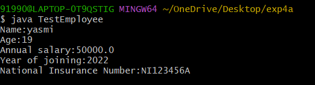
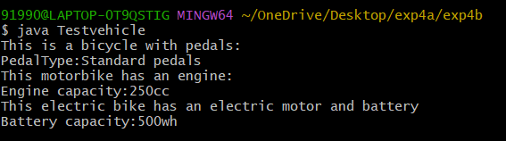
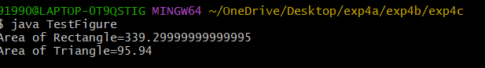

# Expriment 4a
## Tittle : 4a). single inheritance
```
 class persion {
  String name;
  int age;
  persion(String name,int age){
     this.name=name;
     this.age=age;
   }
    void displaypersionDetails(){
      System.out.println("Name:"+name);
      System.out.println("Age:"+age);
   }
 }

class Employee extends persion {
 double annualsalary;
 int yearofJoining;
 String nationalInsuranceNumber;
 Employee(String name,int age,double annualsalary,int yearofJoining,String nationalInsuranceNumber){
 super(name,age);
 this.annualsalary=annualsalary;
 this.yearofJoining=yearofJoining;
 this.nationalInsuranceNumber=nationalInsuranceNumber;
 }
   void displayEmployeeDetails(){
        displaypersionDetails();
        System.out.println("Annual salary:"+annualsalary);
        System.out.println("Year of joining:"+yearofJoining);
        System.out.println("National Insurance Number:"+nationalInsuranceNumber);
     }
    }
public class TestEmployee {
 public static void main(String args[]){
 Employee emp1=new Employee("yasmi",19,50000,2022,"NI123456A");
 emp1.displayEmployeeDetails();
  }
 }
```
#output


## title : 4b). mutli level 
```
 class Bicycle {
 String PedalType;
 void showBicycleInfo(){
  System.out.println("This is a bicycle with pedals:");
  System.out.println("PedalType:"+PedalType);
  }
 }
 class Motorbike extends Bicycle {
 int enginecapacity;
 void showMotorbikeInfo(){
 System.out.println("This motorbike has an engine:");
 System.out.println("Engine capacity:"+enginecapacity+"cc");
  }
 }

class ElectricBike extends Motorbike {
 int batterycapacity;
 void showElectricBikeInfo(){
 System.out.println("This electric bike has an electric motor and battery");
 System.out.println("Battery capacity:"+batterycapacity+"wh");
 }
}

 public class Testvehicle {
  public static void main(String args[]){
          ElectricBike eBike=new ElectricBike();
        eBike.PedalType="Standard pedals";
        eBike.enginecapacity=250;
        eBike.batterycapacity=500;
        eBike.showBicycleInfo();
        eBike.showMotorbikeInfo();
        eBike.showElectricBikeInfo();
     }
   }

```
#output


## tittle : 4c). abstract class
```
 abstract class Figure {
    double dim1;
    double dim2;
    Figure(double dim1, double dim2) {
        this.dim1 = dim1;
        this.dim2 = dim2;
    }

    abstract double area();
}

 class Rectangle extends Figure {

    Rectangle(double length, double breadth) {
        super(length, breadth);
    }

    double area() {
    double result = dim1*dim2;
    return result;
    }
}
 class Triangle extends Figure {
 Triangle(double base,double height){
  super(base,height);
  }
  double area(){
  double result = 0.5*dim1*dim2;
  return result;
  }
 }
 class TestFigure {
    public static void main(String args[]) {

        Figure f1 = new Rectangle(23.4, 14.5);
        Figure f2 = new Triangle(12.3,15.6);
        System.out.println("Area of Rectangle=" + f1.area());
        System.out.println("Area of Triangle=" + f2.area());
   }
}

```
#output



