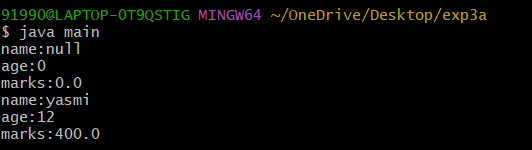
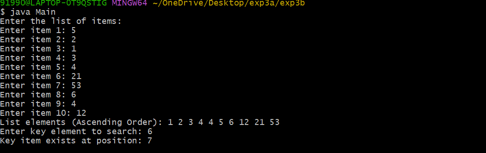
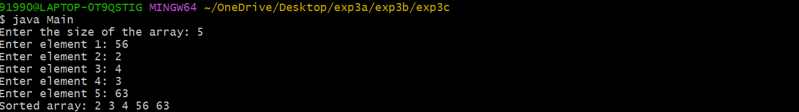

## title : 3a) implement constructor overloading java

```
class Student {
        String name;
        int age;
        double marks;
        Student() {
        }
        Student(String name,int age,double marks) {
                this.name = name;
                this.age = age;
                this.marks = marks;
                }
                void display() {
                System.out.println("name:" +name);
                System.out.println("age:" +age);
                System.out.println("marks:" +marks);
                }
             }
}

class main {
     public static void main(String args[]) {
            Student std = new Student();
             std.display();
            Student std1 = new Student("yasmi", 12,400);
             std1.display();
         }
}
```
#output

## title : 3b) binarysearch
```
import java.util.Scanner;

class Binarysearch {
    int list[];
    int size;

    Binarysearch(int size) {
        this.size = size;
        list = new int[size];
    }

    void setList() {
        Scanner sc = new Scanner(System.in);
        System.out.println("Enter the list of items:");

        for (int i = 0; i < size; i++) {
            System.out.print("Enter item " + (i + 1) + ": ");
            list[i] = sc.nextInt();
        }

        for (int i = 0; i < size - 1; i++) {
            for (int j = 0; j < size - i - 1; j++) {
                if (list[j] > list[j + 1]) {
                    int temp = list[j];
                    list[j] = list[j + 1];
                    list[j + 1] = temp;
                }
            }
        }
    }

    void getList() {
        System.out.print("List elements (Ascending Order): ");
        for (int i = 0; i < size; i++) {
            System.out.print(list[i] + " ");
        }
        System.out.println();
    }

    int Binarysearch(int key) {
        int low = 0;
        int high = size - 1;

        while (low <= high) {
            int mid = (low + high) / 2;

            if (list[mid] == key)
                return mid;
            else if (list[mid] < key)
                low = mid + 1;
            else
                high = mid - 1;
        }
        return -1;
    }
}

import java.util.Scanner;
class Main {
    public static void main(String args[]) {
        Binarysearch bs = new Binarysearch(10);

        bs.setList();
        bs.getList();

        Scanner sc = new Scanner(System.in);
        System.out.print("Enter key element to search: ");
        int key = sc.nextInt();

        int index = bs.Binarysearch(key);

        if (index == -1)
            System.out.println("Key item does not exist");
        else
            System.out.println("Key item exists at position: " + (index + 1));
    }
}
```
#output

## title:3c) bubblesort
```
import java.util.Scanner;

class BubbleSort {
    void bubbleSort(int arr[]) {
        int n = arr.length;
        for (int i = 0; i < n - 1; i++) {
            for (int j = 0; j < n - i - 1; j++) {
                if (arr[j] > arr[j + 1]) {
                    int temp = arr[j];
                    arr[j] = arr[j + 1];
                    arr[j + 1] = temp;
                }
            }
        }
    }
}
import java.util.Scanner;

class Main {
    public static void main(String args[]) {
        Scanner sc = new Scanner(System.in);

        System.out.print("Enter the size of the array: ");
        int size = sc.nextInt();

        int arr[] = new int[size];

        for (int i = 0; i < size; i++) {
            System.out.print("Enter element " + (i + 1) + ": ");
            arr[i] = sc.nextInt();
        }

        // Bubble Sort logic
        for (int i = 0; i < size - 1; i++) {
            for (int j = 0; j < size - i - 1; j++) {
                if (arr[j] > arr[j + 1]) {
                    // swap
                    int temp = arr[j];
                    arr[j] = arr[j + 1];
                    arr[j + 1] = temp;
                }
            }
        }

        System.out.print("Sorted array: ");
        for (int i = 0; i < size; i++) {
            System.out.print(arr[i] + " ");
        }
    }
}
```
#output



