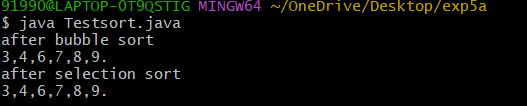
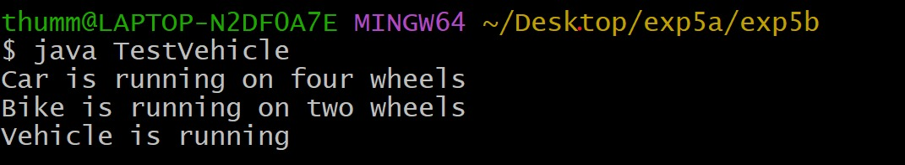
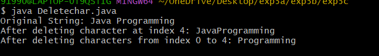

# Experiment 5
## tittle : 5a) sortable
```
 public interface sortable {
    void sort(int arr[]);
}
 public class Bubblesort implements sortable {

    public void sort(int arr[]) {
        int n = arr.length;
        for (int i = 0; i < n - 1; i++) {
            for (int j = 0; j < n - i - 1; j++) {
                if (arr[j] > arr[j + 1]) {
                    int temp = arr[j];
                    arr[j] = arr[j + 1];
                    arr[j + 1] = temp;
                }
            }
        }
    }
}
 public class Selectionsort implements sortable {

    public void sort(int arr[]) {
        int n = arr.length;
        for (int i = 0; i < n - 1; i++) {
            int min = i;
            for (int j = i + 1; j < n; j++) {
                if (arr[j] < arr[min]) {
                    min = j;
                }
            }
            int temp = arr[min];
            arr[min] = arr[i];
            arr[i] = temp;
        }
    }
}

class Testsort {

    static void display(int arr[]) {
        for (int ele : arr) {
            System.out.print(ele + ",");
        }
        System.out.println("\b.");
    }

    public static void main(String args[]) {
        int arr[] = {9, 7, 4, 3, 6, 8};
        int bar[] = {8, 6, 3, 4, 7, 9};

        sortable s;

        s = new Bubblesort();
        s.sort(arr);
        System.out.println("after bubble sort");
        display(arr);

        s = new Selectionsort();
        s.sort(bar);
        System.out.println("after selection sort");
        display(bar);   // ← you forgot this earlier
    }
}

```
#output

## tittle : 5b) vehicle
```
class Vehicle {
    void run() {
        System.out.println("Vehicle is running");
    }
}
class Car extends Vehicle {
    void run() {
        System.out.println("Car is running on four wheels");
    }
}
class Bike extends Vehicle {
    void run() {
        System.out.println("Bike is running on two wheels");
    }
}
public class TestVehicle {
    public static void main(String[] args) {
        Vehicle v;
        v = new Car();
        v.run();
        v = new Bike();
        v.run();
        v = new Vehicle();
        v.run();
    }
}
```
#output

## tittle : 5c) delete
```
 class StringBufferDelete {
    public static void main(String[] args) {
        StringBuffer sb = new StringBuffer("Java Programming");
        System.out.println("Original String: " + sb);
        sb.deleteCharAt(4);
        System.out.println("After deleting character at index 4: " + sb);
        sb.delete(0, 4);
        System.out.println("After deleting characters from index 0 to 4: " + sb);
    }
}


```
#output

