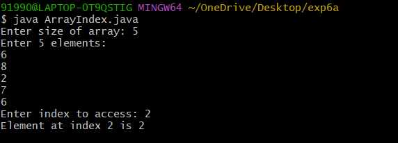
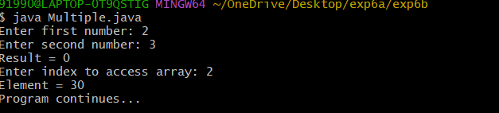
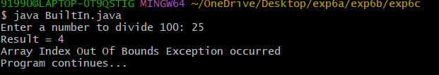

## Tittle : 6a) Exception Handling
```
 import java.util.Scanner;

class ArrayIndexExceptionDemo {
    public static void main(String[] args) {
        Scanner sc = new Scanner(System.in);

        System.out.print("Enter size of array: ");
        int n = sc.nextInt();

        int[] arr = new int[n];

        System.out.println("Enter " + n + " elements:");
        for (int i = 0; i < n; i++) {
            arr[i] = sc.nextInt();
        }

        try {
            System.out.print("Enter index to access: ");
            int index = sc.nextInt();
            System.out.println("Element at index " + index + " is " + arr[index]);
        } catch (ArrayIndexOutOfBoundsException e) {
            System.out.println("Array index out of bounds!");
        }

        sc.close();
    }
}
```
# output


## Tittle : 6b) Multiple Catch
```
import java.util.Scanner;

class MultipleCatchDemo {
    public static void main(String[] args) {
        Scanner sc = new Scanner(System.in);
        int[] arr = {10, 20, 30, 40, 50};

        try {
            System.out.print("Enter first number: ");
            int a = sc.nextInt();

            System.out.print("Enter second number: ");
            int b = sc.nextInt();

            int result = a / b;
            System.out.println("Result = " + result);

            System.out.print("Enter index to access array: ");
            int index = sc.nextInt();
            System.out.println("Element = " + arr[index]);
        }
        catch (ArithmeticException e) {
            System.out.println("Arithmetic Exception occurred");
        }
        catch (ArrayIndexOutOfBoundsException e) {
            System.out.println("Array Index Out Of Bounds Exception occurred");
        }
        catch (Exception e) {
            System.out.println("Some other exception occurred");
        }

        sc.close();
        System.out.println("Program continues...");
    }
}
```
#output


## Tittle : 6c) BuiltIn Exception
```
 import java.util.Scanner;

class BuiltInException {
    public static void main(String[] args) {
        Scanner sc = new Scanner(System.in);

        try {
            System.out.print("Enter a number to divide 100: ");
            int n = sc.nextInt();

            int result = 100 / n;
            System.out.println("Result = " + result);

            int[] arr = new int[3];
            System.out.println(arr[5]);
        }
        catch (ArithmeticException e) {
            System.out.println("Arithmetic Exception occurred");
        }
        catch (ArrayIndexOutOfBoundsException e) {
            System.out.println("Array Index Out Of Bounds Exception occurred");
        }
        catch (Exception e) {
            System.out.println("General Exception occurred");
        }
        finally {
            System.out.println("Program continues...");
            sc.close();
        }
    }
}
```
#output



