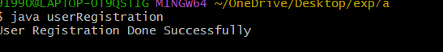
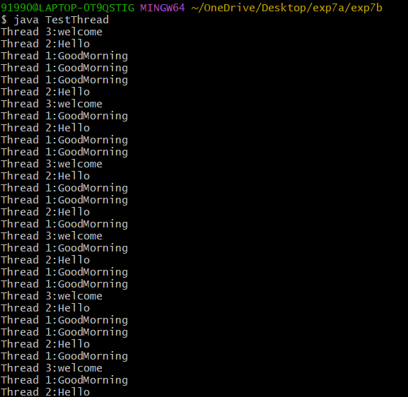
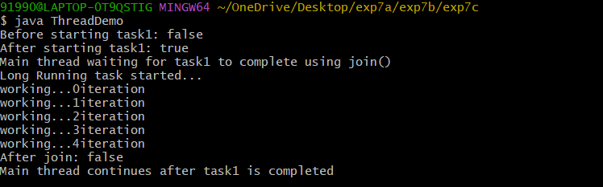

## Tittle : 7a) Invalid Country Exception
```
class InvalidCountryException extends Exception {
  InvalidCountryException() {
    super();
  }
  InvalidCountryException(String message) {
    super(message);
  }
}
 class userRegistration {
  void registerUser(String userName, String userCountry) throws InvalidCountryException {
      if(!userCountry.equals("India")) {
        throw new InvalidCountryException("User outside India cannot be registered");
      }
      else {
        System.out.println("User Registration Done Successfully");
      }
    }

    public static void main(String[] args) {
      userRegistration ur = new userRegistration();
      try {
        ur.registerUser("yashmitha ", "India");

      }
      catch(InvalidCountryException e) {
        System.out.println(e.getMessage());
    }
  }
}
```
# output


## Tittle : 7b) Threads
```
 class Goodmorning extends Thread {
 public  void run() {
 for(int i=0;i<30;i++) {
  System.out.println("Thread 1:GoodMorning");
  try{
  Thread.sleep(1000);
  }
  catch(Exception e){
  System.out.println("Interupted exception occured:"+e);
   }
  }
 }
}
 class HelloThread extends Thread {
  public void run(){
  for(int i=0;i<30;i++){
  System.out.println("Thread 2:Hello");
   try{
   Thread.sleep(2000);
   }
  catch(Exception e){
  System.out.println("Interupted exception occured:"+e);
   }
 }
 }
}
 class WelcomeThread extends Thread {
  public void run() {
  for(int i=0;i<30;i++){
  System.out.println("Thread 3:welcome");
   try{
  Thread.sleep(3000);
   }
  catch(Exception e){
  System.out.println("Interupted Exception occured:"+e);
   }
  }
 }
}
class TestThread {
  public static void main(String args[]) {
  Goodmorning gm = new Goodmorning();
  HelloThread ht = new HelloThread();
  WelcomeThread wt = new WelcomeThread();
        gm.start();
        ht.start();
        wt.start();
      }
}
```
#output



## Tittle : 7c) LongRunning
```
class LongRunningTask extends Thread {
 public void run(){
  System.out.println("Long Running task started...");
    for(int i=0;i<5;i++) {
   System.out.println("working..."+i+"iteration");
    try {
                Thread.sleep(1000);
            } catch (InterruptedException e) {
                System.out.println("Thread interrupted");
            }
   }
  }
 }
  class ThreadDemo {
    public static void main(String args[]) {

        LongRunningTask task1 = new LongRunningTask();

        System.out.println("Before starting task1: " + task1.isAlive());

        task1.start();

        System.out.println("After starting task1: " + task1.isAlive());
        System.out.println("Main thread waiting for task1 to complete using join()");

        try {
            task1.join();   // Wait for task1 to finish
        } catch (InterruptedException e) {
            System.out.println("Main thread interrupted");
        }

        System.out.println("After join: " + task1.isAlive());
        System.out.println("Main thread continues after task1 is completed");
    }
}
```
#output



