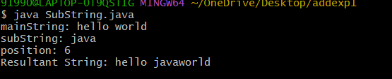
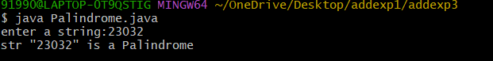
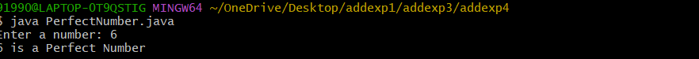

# additional experiment
## title : addexp 1) . substring
```
import java.util.Scanner;
 class InsertSubstring {
    public static void main(String args[]) {
        Scanner sc = new Scanner(System.in);
        System.out.print("mainString: ");
        String mainString = sc.nextLine();
        System.out.print("subString: ");
        String subString = sc.nextLine();
        System.out.print("position: ");
        int position = sc.nextInt();
        if (position < 0 || position > mainString.length()) {
        System.out.println("Invalid Position");
        } else {
            String firstPart = mainString.substring(0, position);
            String secondPart = mainString.substring(position);
            String resultString = firstPart + subString + secondPart;
            System.out.println("Resultant String: " + resultString);
        }
```
#output


## title : addexp3). palindrome
```
import java.util.Scanner;
 class PalindromeCheck {
   public static void main(String args[]) {
     Scanner sc = new Scanner(System.in);
     System.out.print("enter a string:");
     String str = sc.nextLine();
     int start = 0;
     int end = str.length() - 1;
     while(start < end) {
     if(str.charAt(start) != str.charAt(end)) {
     System.out.println("str is  \"" + str + "\" not  Palindrome");
     sc.close();
     return;
     }
     start++;
     end--;
     }
     System.out.println("str \"" + str + "\" is a Palindrome");
     sc.close();
     }
 }
```
#output


## title : addexp4) . perfect number
```
import java.util.Scanner;
class PerfectNumber {
    public static void main(String args[]) {
        Scanner sc = new Scanner(System.in);
        System.out.print("Enter a number: ");
        int num = sc.nextInt();
        int sum = 0;
        for (int i = 1; i < num-1; i++) {
            if (num % i == 0) {
                sum = sum + i;
            }
        }

        if (sum == num) {
            System.out.println(num + " is a Perfect Number");
        } else {
            System.out.println(num + " is not a Perfect Number");
        }

        sc.close();
    }
}
```
#output

        sc.close();
    }
}
