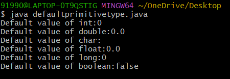
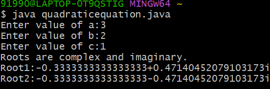
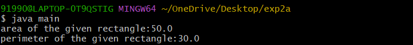
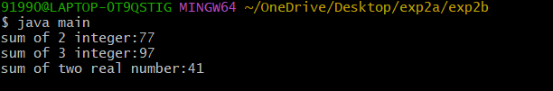
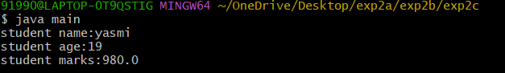

# EXPERIMENT 
## TITLE : 1a.) Display primitive datatypes
```
 class DefaultPrimitiveType {
    int primInt;
    double primDouble;
    char primChar;
    float primFloat;
    long primLong;
    boolean primBoolean;
     public static void main(String args[]) {
      DefaultPrimitiveType dDpt= new DefaultPrimitiveType();
       System.out.println("Default value of int:"+dDpt.primInt);
       System.out.println("Default value of double:"+dDpt.primDouble);
       System.out.println("Default value of char:"+dDpt.primChar);
       System.out.println("Default value of float:"+dDpt.primFloat);
       System.out.println("Default value of long:"+dDpt.primLong);
       System.out.println("Default value of boolean:"+dDpt.primBoolean);
       }
      }
```
# OUTPUT

## TITLE : 1b.) qudratic equation
```
  GNU nano 8.7                                                        quadraticequation.java
import java.util.Scanner;
public class QuadraticEquation {
public static void main(String[] args) {
Scanner sc=new Scanner(System.in);
System.out.print("Enter value of a:");
double a=sc.nextDouble();
System.out.print("Enter value of b:");
double b = sc.nextDouble();
System.out.print("Enter value of c:");
double c = sc.nextDouble();
double D = b*b-4*a* c;
if (D > 0) {
System.out.println("Roots are real and distinct.");
double root1 = (-b + Math.sqrt(D))/(2*a);
double root2 = (-b-Math.sqrt(D))/(2*a);
System.out.println("Root 1:"+root1);
System.out.println("Root 2:"+root2);
} else if (D==0) {
System.out.println("Roots are real and equal.");
double root=-b/(2*a);
System.out.println("Root:"+root);
} else {
System.out.println("Roots are complex and imaginary.");
double realPart =-b/(2*a);
double imaginaryPart = Math.sqrt(-D) / (2 * a);
System.out.println("Root1:"+realPart+"+"+imaginaryPart+"i");
System.out.println("Root2:"+realPart+"-"+imaginaryPart+"i");
}
}
}
```
# output

## title : 2a.) rectangle
```
class Rectangle {
   double length;
  double breadth;
   double area() {
    return length * breadth;
    }
   double perimeter (){
    return 2 *(length + breadth);
    }
   }

class main {
 public static void main(String args[]){
 Rectangle rect = new Rectangle();
          rect.length=10;
          rect.breadth=5;
      double area = rect.area();
      double perimeter = rect.perimeter();
  System.out.println("area of the given rectangle:"+area);
  System.out.println("perimeter of the given rectangle:"+perimeter);
  }
 }
```
# output

## title : 2b.)sum
```
 class sum {
 int sum(int a,int b){
    return a+b;
   }
 int sum(int a,int b,int c){
    return a+b+c;
  }
 double sum(double a,double b){
    return a+b;
  }
 }

 class main {
  public static void main(String args[]){
       sum s = new sum();
   System.out.println("sum of 2 integer:"+s.sum(32,45));
   System.out.println("sum of 3 integer:"+s.sum(20,32,45));
   System.out.println("sum of two real number:"+s.sum(45-56,86-34));
   }
  }

```
# output


## title : 2c.)student
```
 class student {
   String sname;
   int sage;
   double smarks;
   student(String name,int age,double marks){
   sname = name;
   sage = age;
   smarks = marks;
  }
   void display(){
  System.out.println("student name:"+sname);
  System.out.println("student age:"+sage);
  System.out.println("student marks:"+smarks);
  }
 }

 class main {
 public static void main(String args[]){
 student s = new student("yasmi",19,980);
 s.display();
 }
}

```
#output


## title : additional exp2
```
  class Fibonacis {
    int firstNumber;
    int secondNumber;
    int thirdNumber;
    int sum;
    int sizeofFibSequence;
     Fibonacis(int size){
        firstNumber=0;
        secondNumber=1;
        thirdNumber=0;
        sum=0;
        sizeofFibSequence=size;
      }
        void genarateFibSequence(){
         while(sizeofFibSequence>0){
          if(sizeofFibSequence==1)
        System.out.println(firstNumber+".");
        else
        System.out.println(firstNumber+",");
         sizeofFibSequence--;
          sum+=firstNumber;
          thirdNumber = firstNumber + secondNumber;
          firstNumber = secondNumber;
          secondNumber = thirdNumber;
         }
       }
             int getFibsum(){
                if(sum > 0)
                 return sum;
                   else
                   generateSequence();
                return sum;
          }
       }
 import java.util.Scanner;
  class main {
   public static void main(String args[]){
    System.out.print("Enter the size of the fib sequence");
    Scanner sc = new Scanner(System.in);
     int size = sc.nextInt();
      if(size > 0) {
        Fibonacis fib = new Fibonacis(size);
        System.out.print("Fibonacis series are");
        fib.genarateFibsequence();
        System.out.println("The sum of the Fibonacis series are:"+fib.getFibsum());
     }
      else
        System.out.println("Fibonacis sequence and sum cannot be calculate");
    }
  }

```
## output:

